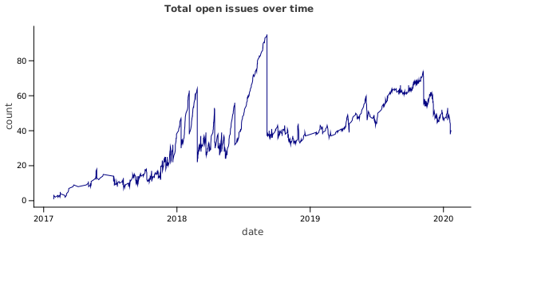
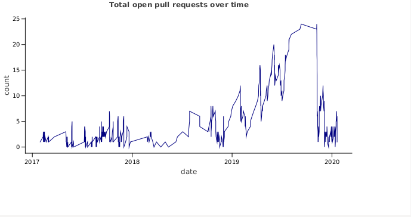

# TeXiFy-stats: statistics for TeXiFy-IDEA

This project uses
* Kotlin
* Gradle Kotlin DSL
* Apollo-Android
* Lets-plot via [lets-plot-kotlin](https://github.com/JetBrains/lets-plot-kotlin)

The JS GraphQL IntelliJ plugin is recommended.

# Setup

Documentation about the setup of the Apollo part of the project: https://stackoverflow.com/questions/59776117/how-to-use-apollo-android-from-kotlin-but-without-android

This project requires Java 11 or later, the following instructions have been tested for Java 13.
* Make sure you have java-openjfx 13 and jdk-openjdk 13 installed.
* In File > Project Structure > Project change the Project SDK and language level both to 13.
* In File > Settings > Build, Execution, Deployment > Build Tools > Gradle change Gradle JVM to 13.

# Currently available plots

